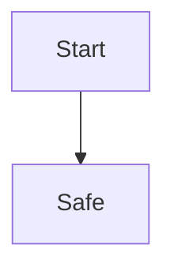

# 手工安全回归用例

本文档用于验证 MD2Anything 在预览、文本导出和服务端 API 三条链路上的恶意 Markdown 处理是否一致且安全。

## 适用范围

本轮回归重点覆盖以下能力：

- 前端预览：`src/components/Preview.tsx`
- 统一渲染内核：`src/utils/enhancedMarkdown.ts`
- HTML 导出：`src/utils/export/html.ts`
- 微信导出：`src/utils/export/wechat.ts`
- 邮件导出：`src/utils/export/email.ts`
- 服务端转换 API：`server/routes/convert.ts`

## 回归目标

需要确认以下约束持续成立：

- 原始危险标签不会在预览或导出结果中执行。
- 事件属性会被清洗，不会残留 `onerror`、`onclick`、`onload` 等属性。
- 危险链接协议会被移除，不会保留 `javascript:`。
- Mermaid 渲染失败时，错误回退内容会被转义而不是直接注入。
- 邮件 preview text 会正确转义 `< > & " '` 等字符。
- 前端预览、文本导出和 API 输出在安全策略上保持一致。

## 执行方式

### 前端预览

1. 启动前端：`npm run dev`
2. 在编辑器中粘贴下方测试 Markdown。
3. 观察预览区是否出现脚本执行、弹窗、异常跳转、DOM 注入或未转义原始 HTML。

### 前端文本导出

1. 在相同测试输入下分别执行：
2. 通用 -> `复制HTML代码` / `导出HTML`
3. 微信 -> `复制`
4. 邮件 -> `复制邮件HTML`
5. 将输出粘贴到纯文本编辑器或 HTML 查看器中，检查危险标签、属性和协议是否仍然存在。

### 服务端 API

1. 启动服务：`npm run server`
2. 对 `/api/convert/plain`、`/api/convert/html`、`/api/convert/wechat`、`/api/convert/email` 分别发送同一组输入。
3. 检查返回的 `html` 字段，确认安全策略与前端一致。

示例：

```bash
curl -X POST http://localhost:3001/api/convert/plain \
  -H "Content-Type: application/json" \
  -d '{"markdown":"# test"}'
```

## 用例矩阵

| 编号 | 场景 | 风险点 | 预期 |
|------|------|--------|------|
| 01 | `<script>` 标签 | 脚本执行 | 标签被移除，不执行 |
| 02 | 事件属性 | DOM XSS | `onerror` / `onclick` 等属性被移除 |
| 03 | `javascript:` 链接 | 点击执行脚本 | 协议被移除或链接失效 |
| 04 | `iframe` / `form` | 嵌入与表单注入 | 标签被移除 |
| 05 | 原始内联 HTML | 策略漂移 | 仅保留白名单标签与安全属性 |
| 06 | Mermaid 恶意内容 | SVG/innerHTML 注入 | 渲染结果被清洗，失败回退被转义 |
| 07 | KaTeX 异常公式 | 回退注入 | 错误内容以文本显示，不插入 HTML |
| 08 | 邮件 preview text | 预览头注入 | 特殊字符被转义 |
| 09 | 图片协议 | 非法资源协议 | `javascript:` 被拦截，`http/https/data` 正常 |
| 10 | 代码块内容 | 代码高亮误执行 | 作为文本显示，不执行 |

## 详细用例

### 用例 01：`<script>` 标签

测试输入：

````markdown
# Script Test

<script>alert('xss')</script>

正文
````

验证点：

- 预览区不弹窗。
- 导出 HTML 中不应保留 `<script>` 标签。
- API 返回的 HTML 中不应保留 `<script>` 标签。

### 用例 02：事件属性注入

测试输入：

````markdown
# Event Attr Test


<div onclick="alert('xss')">click me</div>
````

验证点：

- 预览区不弹窗。
- 输出 HTML 中不应保留 `onerror`、`onclick`。
- 若标签被保留，仅允许白名单属性存在。

### 用例 03：`javascript:` 链接

测试输入：

````markdown
[危险链接](javascript:alert('xss'))
````

验证点：

- 预览中的链接不应保留 `javascript:`。
- 导出与 API 输出中的 `<a>` 标签不应包含危险协议。
- `rel="noopener noreferrer"` 仍应存在。

### 用例 04：`iframe` / `form` / 可交互原始标签

测试输入：

````markdown
<iframe src="https://example.com"></iframe>

<form action="https://evil.example/submit">
  <input name="token" value="secret" />
  <button type="submit">submit</button>
</form>
````

验证点：

- `iframe`、`form`、`button` 应被移除。
- 当前策略下 `input` 可能被保留，但不应携带危险属性。
- 如果后续决定彻底禁止表单类标签，应同步更新本用例预期。

### 用例 05：原始 HTML 白名单边界

测试输入：

````markdown
<div class="safe">safe block</div>
<span class="safe">safe inline</span>
<hr />
<table><tr><td>cell</td></tr></table>
<style>body{background:red}</style>
````

验证点：

- `div`、`span`、`hr`、`table` 等白名单标签可保留。
- `class` 仅在允许的标签上保留。
- `<style>` 标签必须被移除。

### 用例 06：Mermaid 注入与失败回退

测试输入 A：

````markdown

````

测试输入 B：

````markdown
```mermaid
graph TD
  A[] --> B[test]
```
````

测试输入 C：

````markdown
```mermaid
graph TD
  A -->
```
````

验证点：

- 正常 Mermaid 能渲染。
- 渲染后的 SVG 不应残留脚本、事件属性或危险外链。
- 语法错误时，应显示转义后的错误文本，不应把原始 HTML 注入到错误面板。

### 用例 07：KaTeX 错误回退

测试输入：

````markdown
$$

$$
\\notacommand{<script>alert(1)</script>}
$$
````

验证点：

- 公式异常时只显示错误文本。
- 错误文本中的 ``、`<script>` 必须被转义显示。

### 用例 08：邮件 preview text 转义

测试输入：

````markdown
# 邮件标题 <script>alert('xss')</script>

正文包含 <b>HTML</b> & "quotes" 'single quotes'
````

验证点：

- 邮件 HTML 中隐藏 preview text 区域不应包含未转义的 `<script>`。
- `&`、`"`、`'`、`<`、`>` 应以实体形式出现。
- 前端邮件导出与服务端 `/api/convert/email` 结果应一致。

### 用例 09：图片协议白名单

测试输入：

````markdown


)
````

验证点：

- `https:` 图片应正常保留。
- `data:` 图片应按当前策略保留。
- `javascript:` 图片源必须被移除或整标签失效。

### 用例 10：代码块与原始 HTML 混排

测试输入：

````markdown
```html
<script>alert('xss')</script>

```
````

验证点：

- 代码块内容应仅作为文本高亮展示。
- 不应因为高亮或解码流程而执行其中的 HTML/脚本。

## 建议检查顺序

1. 先跑前端预览，确认不会出现主动执行。
2. 再检查通用 HTML 导出和 API `/plain`，确认统一渲染内核的清洗结果。
3. 然后检查微信和邮件导出，确认包装层没有重新引入危险属性。
4. 最后单独复验 Mermaid 和邮件 preview text，这两处是本轮安全边界最容易回归的位置。

## 结果记录

本轮已完成一轮脚本化回归，覆盖统一渲染内核、前端邮件导出和服务端四个转换端点。

### 本轮结论

- `parseEnhancedMarkdown` 对 `<script>`、事件属性、`javascript:` 协议、`style` 标签、危险图片协议的清洗结果符合预期。
- `/api/convert/plain`、`/api/convert/html`、`/api/convert/wechat`、`/api/convert/email` 已验证与统一渲染内核保持一致。
- 邮件 preview text 曾发现一处策略漂移：原实现直接截取原始 Markdown 并转义，导致隐藏预览文本里仍可能出现 `javascript:` 和 `onerror=` 这样的危险字样。该问题已在前端 [src/utils/export/email.ts](../src/utils/export/email.ts) 和服务端 [server/utils/email.ts](../server/utils/email.ts) 修复，改为先做 Markdown 降噪再转义输出。
- Mermaid 的 SVG sanitize 和浏览器预览侧真实渲染，仍建议保留一次手工点击验证；当前这份结果主要覆盖纯函数与 API 输出。

### 脚本化验证结果

| 用例 | 预览 | HTML 导出 | 微信导出 | 邮件导出 | API plain | API html | API wechat | API email | 备注 |
|------|------|-----------|----------|----------|-----------|----------|------------|-----------|------|
| 01 | 未实机点击 | 通过 | 未单独执行 | 未单独执行 | 通过 | 通过 | 通过 | 通过 | `<script>` 已移除 |
| 02 | 未实机点击 | 未单独执行 | 未单独执行 | 通过 | 通过 | 通过 | 通过 | 通过 | `onerror` / `onclick` 已移除 |
| 03 | 未实机点击 | 未单独执行 | 未单独执行 | 通过 | 通过 | 通过 | 通过 | 通过 | `javascript:` 已移除，链接仍存在 |
| 04 | 未测 | 未测 | 未测 | 未测 | 未测 | 未测 | 未测 | 未测 | 仍需补手工验证 |
| 05 | 未实机点击 | 未单独执行 | 未单独执行 | 未单独执行 | 通过 | 未单独执行 | 未单独执行 | 未单独执行 | `<style>` 已移除，白名单标签保留 |
| 06 | 未测 | 不适用 | 不适用 | 不适用 | 不适用 | 不适用 | 不适用 | 不适用 | Mermaid 仍需浏览器侧验证 |
| 07 | 未实机点击 | 未单独执行 | 未单独执行 | 未单独执行 | 通过 | 未单独执行 | 未单独执行 | 未单独执行 | KaTeX 输出未出现原始 `<script>` |
| 08 | 不适用 | 不适用 | 不适用 | 通过 | 不适用 | 不适用 | 不适用 | 通过 | preview text 已不含 `<script>` / `javascript:` / `onerror=` |
| 09 | 未实机点击 | 未单独执行 | 未单独执行 | 未单独执行 | 通过 | 未单独执行 | 未单独执行 | 未单独执行 | `https/data` 保留，`javascript:` 被拦截 |
| 10 | 未实机点击 | 未单独执行 | 未单独执行 | 未单独执行 | 通过 | 未单独执行 | 未单独执行 | 未单独执行 | 代码块作为高亮文本输出 |

### 复现实验记录

本轮主要使用以下方式验证：

- `npx tsx` 直接调用 `parseEnhancedMarkdown`，检查渲染结果中是否仍包含危险片段。
- `npx tsx` 直接调用 `markdownToEmailHTML`，检查邮件 preview text 是否残留危险字样。
- `curl` 调用 `/api/convert/plain`、`/html`、`/wechat`、`/email`，检查返回的 `html` 字段是否仍包含危险片段。
- `npm run lint` 作为回归后静态检查，当前已通过。

## 已知注意事项

- 当前清洗配置允许 `img` 的 `data:` 协议，这是为了兼容内嵌图片；回归时要确认没有误放开其他危险协议。
- 当前清洗配置允许 `input[type|checked|disabled]`，这是为了兼容 GFM task list；如果未来收紧策略，需同步修改测试预期。
- Mermaid 最终是先渲染 SVG，再单独进行一次 SVG sanitize；不要只检查 Markdown 主渲染结果。
- 邮件和微信链路会对统一渲染结果再做样式包装，回归时要关注包装过程是否意外保留或新增属性。
